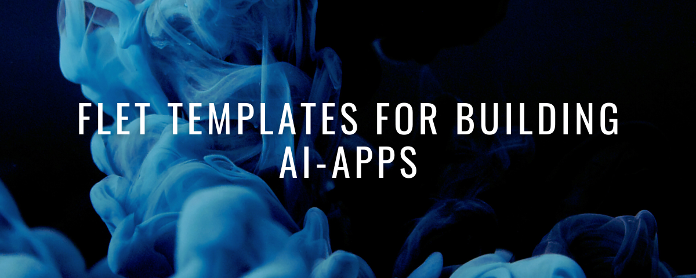
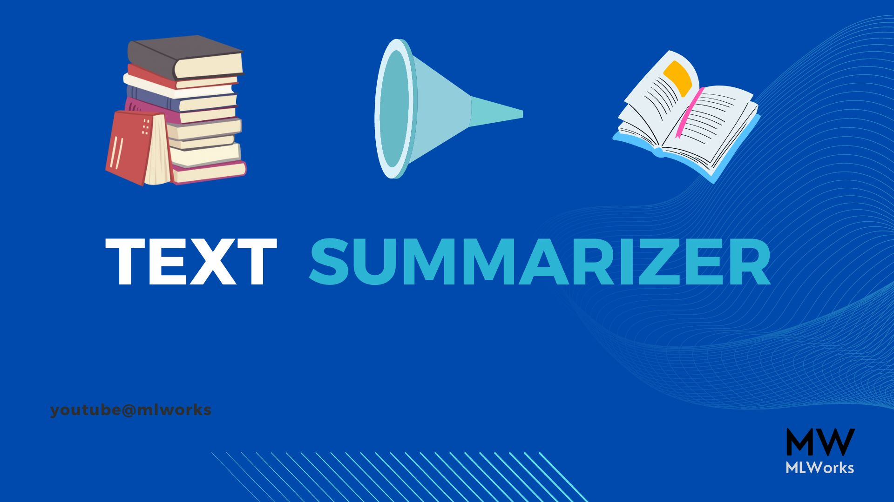
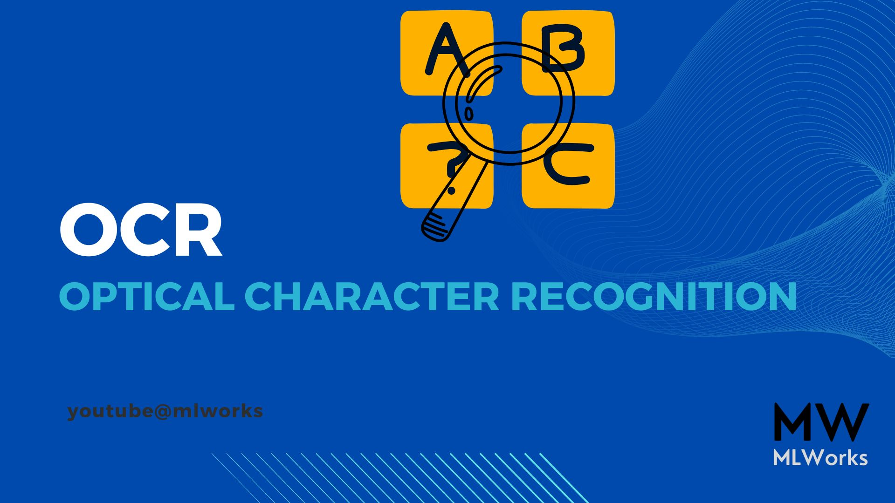
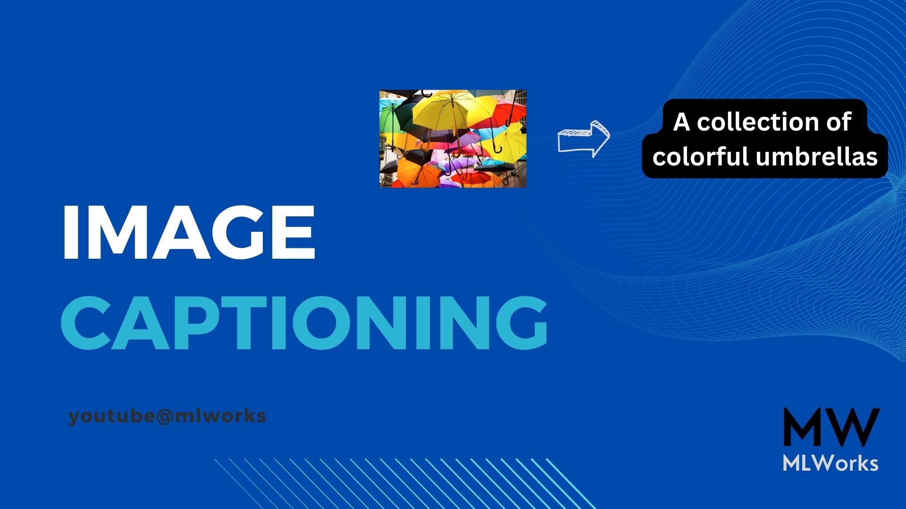
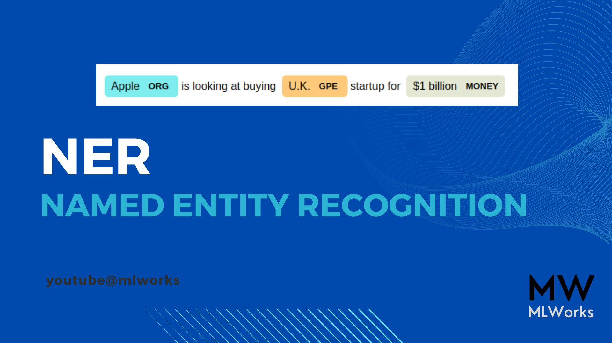

## Flet Templates for building AI Apps



I am excited to share with the community of coders to play around with Python's Felt templates to build your own AI-based desktop/mobile app.

### Pre-requisite:

- Python3.7

- [How to install Python in different OS](https://kinsta.com/knowledgebase/install-python/)

### How to setup Virtual Environment:

```python
python3 -m venv "name of the virtual environment"
```

- [Virtual Environment Setup](https://www.dataquest.io/blog/a-complete-guide-to-python-virtual-environments/)

### Environment Setup:

After switching to the virtual environment, install packages from requirements.txt to support all templates.

```python
pip install -r requirements.txt
```
Sample Demo:

[OCR Template](https://youtu.be/B7Cfzum6YA8)


**Here are five templates to handle different AI tasks which you'll love to explore and turn into an app:**

### Text-Summarizer



Summarization is the task of producing a shorter version of a document while preserving its important information. Some models can extract text from the original input, while other models can generate entirely new text.

- **Model Detail**

    Facebook's BART Model (Available in HuggingFace)

### OCR(Optical Character Recognition)



OCR transforms a two-dimensional image of text, which could be machine-printed or handwritten text from its image representation into machine-readable text. OCR is a collection of subprocesses as follows:

- Preprocessing of the Image

- Text Localization

- Character Segmentation

- Character Recognition

- Post Processing

**Model Detail**

- EasyOCR

### Image Captioning (Image-To-Text)



Image-to-text is also called Image Captioning. It is the process of generating a textual description of an image. It uses both Natural Language Processing and Computer Vision to generate the captions.

**Model Details**

- VIT-GPT2 Image Captioning Model (available in HuggingFace)

### Keyword/Tag Extractor


A keyword extractor is a tool that provides a list of keywords from existing text, which can be used as a tag on YouTube or other social platforms.

- **NLP techniques with SpaCy**

### NER - Named Entity Extraction



Named Entity recognition, is a popular method that is used for recognizing entities that are present in a text document. The model can find different entities that are present in the text such as persons, dates, organizations, and locations. In simple words, it is used as an information extraction tool.

**Model Details**

- SpaCy's Pretrained Model

**If you find the templates useful, you can subscribe to my [YouTube Channel](https://www.youtube.com/@mlworks), where I share my experience in ML and MLOps.**